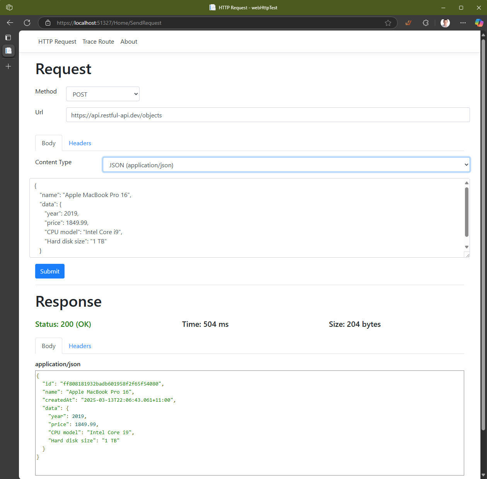

# Web HTTP Test

A simple HTTP test client. Deploy into an environment and make HTTP calls that originate on the host.

Also serves the following APIs:

* `/api/environment`: returns host environment details
* `/api/work?cpu=XXX&duration=YYYY`: generate load on the host with cpu=%cpu and duration=#milliseconds
* `/api/get?url=encodedurl`: http get from the host to encoded url
* `/api/echo`: echo all details of the request - verb, path, params, body, headers

Container image can be found at `davidxw/webtest:latest`. Ingress on port 8080.